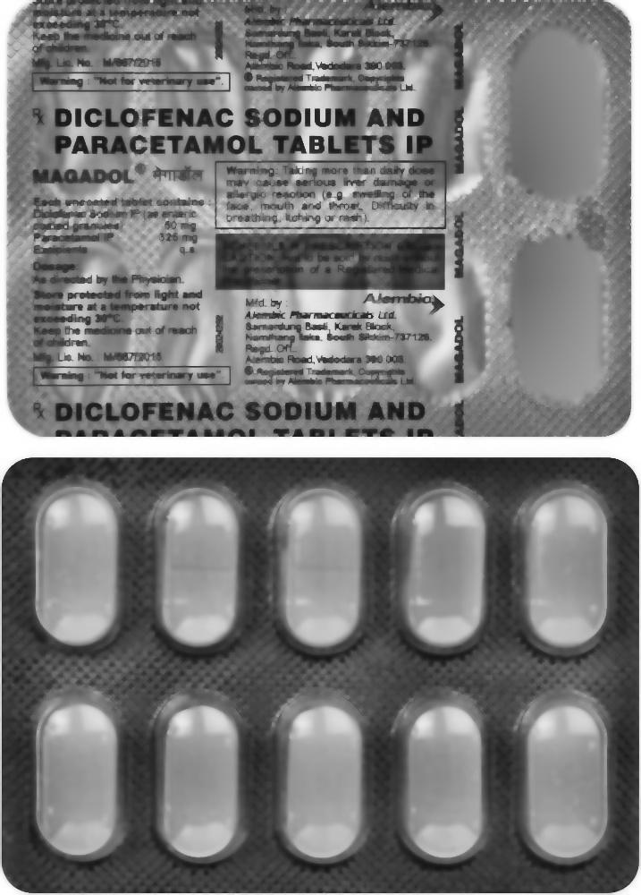
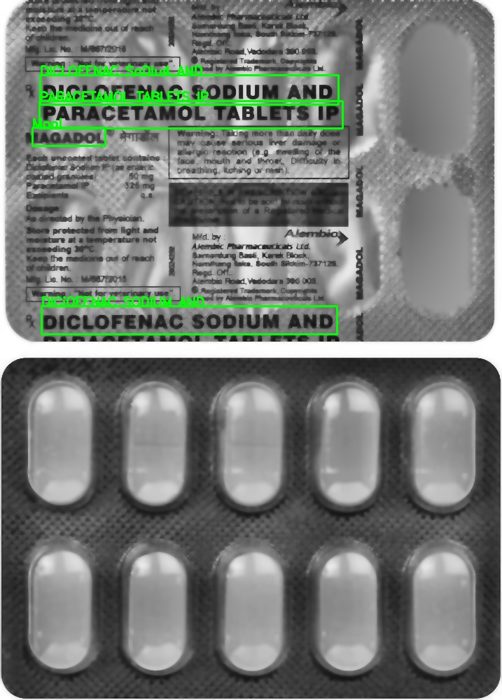
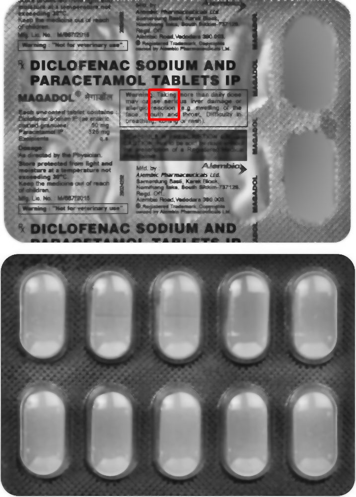

MedTrace — Forensic Inspection of Medicine Strip Authenticity

MedTrace is a forensic computer vision pipeline designed to inspect medicine strip images for signs of tampering, surface disturbance, and authenticity risks.

It combines:
	•	Illumination correction for reflective foil
	•	OCR extraction of printed drug data
	•	Micro-texture forensics using Edge Density + LBP
	•	Evidence-based inspection verdict in structured JSON

Built as a research-grade CV inspection system, not a UI app or demo script.

⸻

🔍 Problem Statement

Critical information like drug name, batch number, and expiry date is printed on reflective aluminum foil.

This surface is:
	•	Prone to scratches and abrasions
	•	Vulnerable to overwriting and tampering
	•	Difficult for OCR due to glare and texture noise

MedTrace demonstrates how computer vision and surface forensics can be used to detect these anomalies from a simple image.

⸻

 Pipeline Architecture

Input Strip Image
        ↓
Foil Illumination Correction (CLAHE + Bilateral + Morphology)
        ↓
Deskew & Preprocessing
        ↓
OCR Detection (EasyOCR)
        ↓
Texture Forensics
   ├─ Edge Density (Canny)
   └─ LBP Micro-Texture Analysis
        ↓
Anomaly Scoring (0–100)
        ↓
Forensic Inspection Report (JSON)

⸻

 Visual Evidence

🧼 Foil Cleaning — 

Removes glare and foil noise for reliable analysis.

⸻

OCR Detection — 

Bounding boxes around detected text after preprocessing.

⸻

Texture Heatmap — 

Edge heatmap showing foil disturbance regions.

⸻

 Tamper Region — 

Most suspicious region highlighted.

⸻

 Techniques Used

Technique	                          Purpose
CLAHE Contrast Normalization	    Remove foil illumination bias
Bilateral Filtering.            	Reduce glare while preserving edges
Morphological Operations	        Remove foil speckles
Deskewing	                        Improve OCR alignment
EasyOCR	                            Text extraction from processed foil
Canny Edge Detection	            Detect scratches / overprints
Local Binary Patterns (LBP)      	Detect micro-texture disturbance
Normalized Multi-Signal             Realistic forensic tamper score

⸻

▶ How to Run

python main.py sample_images/your_image.png

⸻

 Output Artifacts

After each run, MedTrace generates:

foil_clean.jpg
preprocessed.jpg
ocr_output.jpg
tamper_heatmap.jpg
tamper_output.jpg
ocr_text.txt
verdict.json

These files together form a forensic inspection record.

⸻

 Project Structure

medtrace/
 ├── preprocess.py      # Foil correction
 ├── ocr.py             # OCR + deskew + preprocessing
 ├── tamper.py          # Edge + LBP forensic analysis
 ├── parser.py          # Field extraction
 ├── main.py            # Pipeline runner
 └── sample_images/

⸻

 Forensic JSON Report Example

{
  "drug_name": "PARACETAMOL TABLETS IP",
  "batch_number": "NOT FOUND",
  "expiry_date": "NOT FOUND",
  "tamper_score": 65.09,
  "confidence": "65.09%",
  "evidence": "High edge-density and micro-texture disturbance detected on foil surface",
  "verdict": "SUSPICIOUS"
}

⸻

Why This Project Matters

This project simulates techniques used in:
	•	Pharmaceutical packaging inspection
	•	Anti-counterfeit analysis
	•	Surface forensics
	•	Regulatory quality checks

It shows how pure computer vision can extract safety insights from difficult reflective surfaces.

⸻